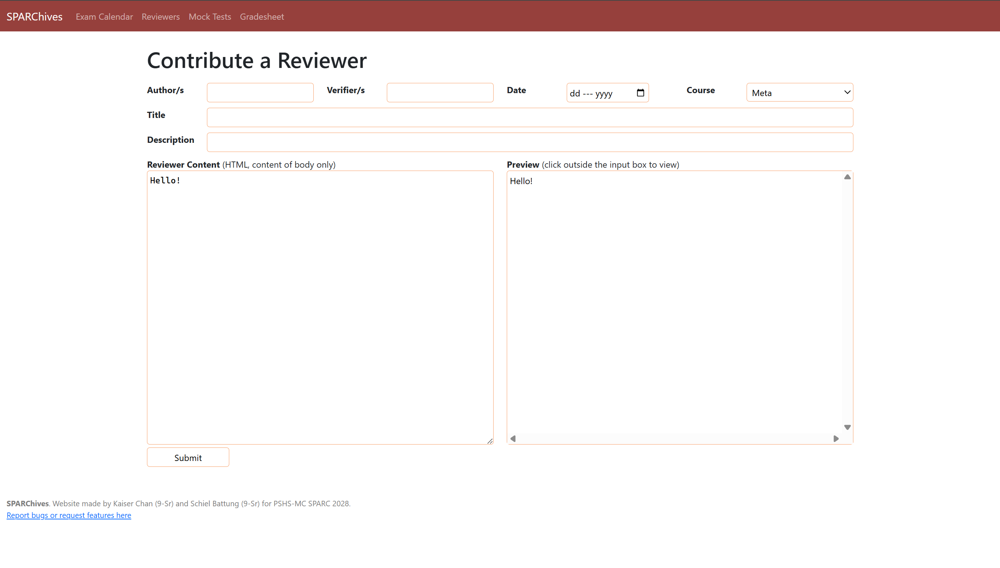
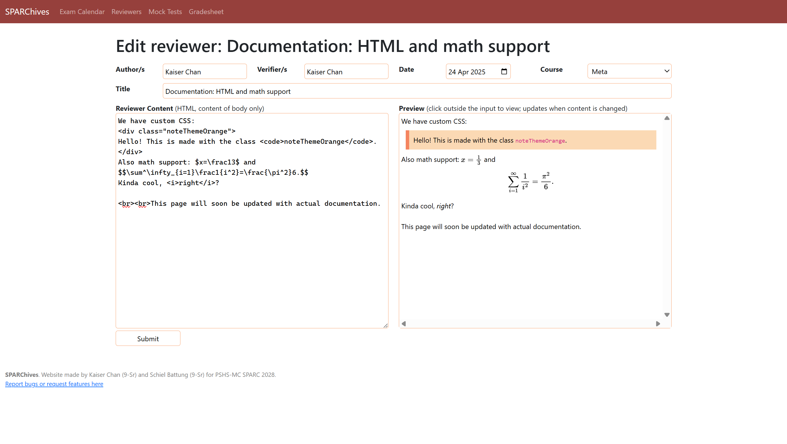
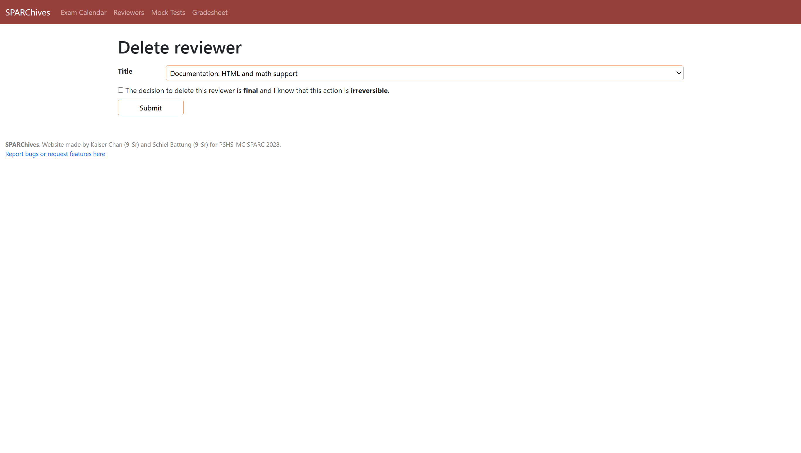

<h1>
  Project proposal: SPARChives 📦
</h1>

<h3>
  Abstract
</h3>
<hr>
"SPARC" or 'Scholars of Pisay's Academic Reviewer Committee' is a student-led organization in PSHS-MC Batch 2028 that delivers 
and distributes multiple academic services across the students of PSHS-MC batch 2028  including reviewers, mock long tests, exercises
or mini-quizzes that aid them in future assessments, especially with their midterm or periodic exams. 
The main purpose of this website, entitled "SPARChives" is to serve as a multi-purpose hub or digital headquarters for the organization.
Due to the nature of this project being a three part output, each quarter we will add other functions as needed by the committee but in this quarter we will focus
on student utilities (see secondary functions). 
<hr>
<h3>
  Website content and functions
</h3>
<ul>
  <li>Homepage</li>
  <ul>
    <li> The homepage is the page that contains all the hyperlinks (buttons) that direct the user to other functions of the website. We take reference from Scribbr.com for the main UI!</li>
  </ul>
  <li>Reviewers (for current and previous school years)</li>
  <li>Interactive mock tests (users put in their answers and the computer can check them)</li>
  <ul>
    <li>JS incorporation: Using a similar javascript programmed by Kaiser Travis Chan for the prototype, the test format (exclusive to a single link) is such so it will be very similar to an online test or gform with fill in the blank options. 
The needed inputs are then processed and determined if right or wrong by the system. The website also makes the user opt for a timed version where it will automatically return the score of answered items once the time has ellapsed</li>
  </ul>
  <li>Math practice (randomized problems from a database of "templates") -- **discontinued**</li>
  <ul>
    <li>JS incorporation: the computer will randomly select problem templates and generate numbers to fit those templates. It will also check the user's answers and track their progress.</li>
  </ul>
</ul>
<h4>
  Utility/secondary functions
</h4>
<ul>
  <li>GWA calculator</li>
  <ul>
    <li>JS incorporation: The website has preset subjects (the 9 pisay subjects for AYP) which the
user can freely remove or change (in the form of bars). Within those bars is an input box containing the units which the person can also freely edit
as well as a + and - (to increase or decrease). User can also has an option to create custom subjects for their courses
    The javascript incorporation here is quite self explanatory where the program receives inputs and return a final grade that's calculated through the specified GWA formula</li>
  </ul>
  <li> GPA calculator (additional to the default GWA calculator for diversity) The JS incorporation is similar or exactly the same as the GWA calc</li>
</ul>

<ul>
  <li> The gradesheet function is also a utility function. Using similar UI the the GWA calc, a main bar (table) will represent a certain course. 
  It is up to the user to freely divide the table and add their scores in fractions. Multiplying them with the set percentages for the requirement type, the program will return the final score.</li>
</ul>

<hr>

### Uses of JSON, databases, and/or storage
All current pages in SPARChives will be converted to database format. A database structure for reviewers is already underway, with a form to add reviewers in HTML format (with LaTeX support and custom SPARC CSS classes) and a page to view reviewers using GET. Reviewer update and deletion functions will still be made. Each reviewer contains the following:

```js
"reviewerName": {
  "author": text-string,
  "verifier": text-string,
  "date": date,
  "course": text-string,
  "title": text-string,
  "content": text-string
}
```

Mock tests will follow a similar format, with questions being added using an "Add Question" button and containing the following:
```js
"q1": {
  "type": text-string,   // can be "radio", "checkbox", "text", "number", or "essay"
  "statement": text-string,
  "points": number,
  "answer": text-string,
  "explanation": text-string
}
```
The mock test would then contain the following data:
```js
"mockTestName": {
  "description": text-string;
  "instructions": text-string;   // additional instructions to add to the default set of instructions
  "timeLimit": number;   // in seconds
  "questions": array;
  "pdf": pdf-file;   // [OPTIONAL] so the user can print/download the questions
}
```

The reviewer CRUD processes have already been implemented as of now (5 May 2025).





<hr>
<!--
<h3>
  Kindly refer to <a href="https://www.canva.com/design/DAGVaV8y1DY/JaB3C07QIKqZ-RQtxEz4FQ/edit">this canva link</a> for the wireframe designs.
</h3>
-->